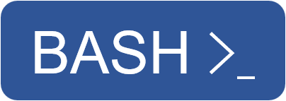

<h1> Hi 👋, I'm Linz. </h1>

<h4>
  
   Email:
  <a href="mailto:zeroherolin@outlook.com">zeroherolin@outlook.com</a>
</h4>

<h2 align="left"> Languages and Tools:
  
  <a href="https://www.cprogramming.com/" target="_blank" rel="noreferrer"> 
  
  
  
  
  
  
  
  
  
  
  
</h2>

<h2 align="left"> My Recent Projects:
  <a href="https://github.com/zeroherolin/sar-dsl">sar-dsl</a>
  <a href="https://github.com/zeroherolin/dma-sg-cxx-project">dma-sg-cxx-project</a>
  <a href="https://github.com/zeroherolin/pytorch-nn">pytorch-nn</a>
</h2>

<h2 align="left"> Projects I'm Following:
  <a href="https://github.com/zeroherolin/llvm-project">llvm</a>
  <a href="https://github.com/zeroherolin/tvm">tvm</a>
  <a href="https://github.com/zeroherolin/triton">triton</a>
  <a href="https://github.com/zeroherolin/torch-mlir">torch-mlir</a>
  <a href="https://github.com/zeroherolin/ScaleHLS-HIDA">scalehls</a>
</h2>

<table width=100%>
<tr>
  <td> 
  
 </td>
  <td> 
  
 </td>
</tr>
</table>

